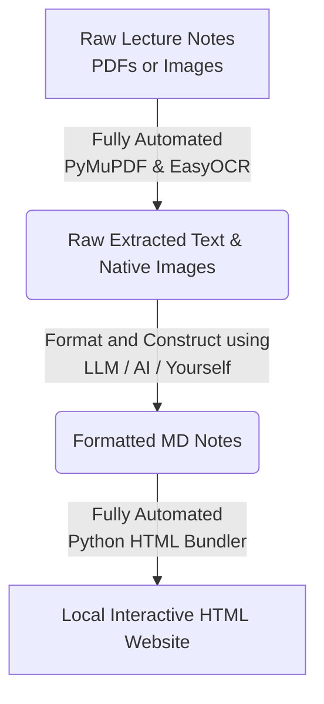

# Notes 2 Website

**Anyone can make their own study-notes website with a single command: `execute.bat`.**

Notes 2 Website is a standalone, portable CLI tool that utilises PyMuPDF & EasyOCR to automate conversion of entire folders of raw lecture PDFs or images into a consolidated, highly-searchable, offline, beautifully formatted HTML website. Built for students who want a blazingly fast, searchable knowledge base without wrestling with complex setups. Especially suitable for open-book exams.
Limitations from existing solutions:
- search function limited to individual chapters/pdf files 
==> I batch search for you
- readability is limited by clutter due to numerous pdfs/images courses 
==> An offline website is much cooler for consolidation and highly accessible
- notes builder exist but are usually complicated to use and require a lot of setup 
==> I make it simple and portable

Requirement:
- Terminal interface or IDE (preferred) e.g. vs code
- Python 3.8 or higher
- Windows 10 or higher (this tool is mine and im a windows user)
- A good inline editor with LLM such as vscode with github copilot or Antigravity to format your extracted texts (or you can do it yourself :p)
- You need some notes lol
  
Don't trust me? Want a demo?
[Click to view demo](https://yxiang-828.github.io/notes-2-website/)

## How It Works




## What it Does

- **One-Click Magic**: Just drop your PDFs and images into the `input/` folder and run `execute.bat`. It automatically handles text extraction and OCR (using PyMuPDF and EasyOCR).
- **Offline First**: The generated `output/` website is completely static HTML/JS/CSS. No local servers, node modules, or database required. It runs instantly from your hard drive anywhere.
- **Smart Search**: Quickly find any keyword across all your chapters with fuzzy highlighting and precise auto-scrolling (Press `Ctrl+K`).
  
- **Session Chapter Deletion**: Don't want to study a certain chapter right now? Delete it instantly from the sidebar for your current session.
  

## Constraints & Requirements

- **Windows Only**: Powered heavily by batch scripting for maximum automated ease-of-use.
- **CLI Interface**: Driven entirely by a conversational terminal prompt (`execute.bat`).
  
- **Requires LLM Formatting (Recommended)**: The raw text extracted directly from PDFs via OCR is *messy*. While this tool gets all the raw data into the `staging/` folder, **you are highly encouraged to use a Local or API-based LLM** (like Copilot, ChatGPT, or Antigravity) to properly format those raw files into clean Markdown before publishing. (Online web AI tools can also work, but suffer from token limits for long lectures).

---

## 🚀 Getting Started

To get your own offline knowledge base running immediately, head to [Releases](https://github.com/Yxiang-828/notes-2-website/releases) to get your latest copy!

Or if you are a hardcore programmer, start with an empty directory or your preferred workspace and clone the repository:

```bat
git clone https://github.com/Yxiang-828/notes-2-website
cd notes-2-website
```

Once inside, you can immediately begin using the Standard Workflow below.

---

## 🛠️ The Standard Workflow

Run `execute.bat` to launch the interactive prompt. It will automatically check your Python dependencies.

### Step 1: Extract
Drop as many PDF, PNG, JPG, or JPEG files as you like into the `input/` directory, then choose **'E'** in the script. It will extract all text, read text embedded inside the images, and dump the raw results into the `staging/` folder.

### Step 2: Organize & Format
**DO NOT SKIP THIS.** The raw outputs in `staging/` will look something like this:
```
staging/
└── Lecture_1/
    ├── Lecture_1.md      <-- Edit this file!
    └── images/
        └── page_1_img_1.jpg
```
You must open the generated `.md` files and *manually format/clean them* into proper Markdown. Use an LLM to drastically speed this up! You can rename the `.md` files to anything you want, as long as it has the `.md` extension.

### Step 3: Publish
Run `execute.bat` again and choose **'P'**. This will intelligently read your curated Markdown from `staging/` and natively bundle them into the fully interactive `output/` site. 

**Your default browser will then automatically pop open `output/index.html` to display your newly built website! 🎉** If it doesn't, navigate to the `output/` folder and double click `index.html`.

---

## ⚙️ Alternative Commands (Granular Control)
If you prefer not to use the interactive `execute.bat` prompt, you can run the explicitly separate batch scripts provided in the repository for more granular control:

- `launch.bat`: Just opens the website. That's it. Double click and go.
- `setup.bat`: Only checks and installs the necessary Python dependencies (`PyMuPDF`, `EasyOCR`, `Pillow`).
- `1_extract.bat`: Only executes the extraction script to process the files in `input/` and writes them into `staging/`.
- `2_build.bat`: Only runs the builder to compile whatever is currently sitting inside `staging/` into your `output/` website.

---

## 💾 Portability & Sharing
**"How do I transfer or share my website with friends without GitHub?"**

Because `notes-2-website` is entirely strictly self-contained front-end HTML, you do *not* need to host it or run an installer to share it. 

To share your site:
1. Simply **Zip the `docs/` folder**.
2. Send that Zip file to anyone.
3. They unzip it on their computer, double click `index.html`, and the perfectly functioning site launches instantly!

To easily reference to it, sharing it on github pages works too.
---

## ⚠️ Important edge cases to know

1. **Wait, I accidentally deleted files in `staging/`!**
   - **Before Publishing**: If you delete a folder inside `staging/` *before* hitting "Publish", that chapter simply **will not exist** on your website. 
   - **After Publishing**: If you delete the `staging/` files *after* you've successfully Published, **your HTML website will still work permanently!** The data is fully bundled.
   - **Warning**: However, if you delete `staging/` files and then run "Publish" *again*, your previously generated chapters will be explicitly overwritten and erased!

2. **Can I manually add my own data directly to `staging/` without Extracting?**
   Yes! You do not actually need to run "Extract" at all. You can manually create a folder structured like this:
   ```
   staging/
   └── My Amazing Custom Chapter/
       ├── Any_Name.md      <-- Can be named perfectly anything as long as it's .md
       └── images/
           └── my_custom_diagram.png
   ```


